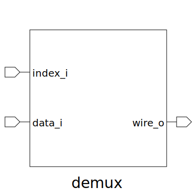

# demux (module)

### Author : Subhan Zawad Bihan (https://github.com/SubhanBihan)

## TOP IO

## Description

Write a markdown documentation for this systemverilog module:
 **This file is part of DSInnovators:rv64g-core**
 **Copyright (c) 2024 DSInnovators**
 **Licensed under the MIT License**
 **See LICENSE file in the project root for full license information**

## Parameters
|Name|Type|Dimension|Default Value|Description|
|-|-|-|-|-|
|NUM_OUPUT|int||8| Parameter to define the number of output lines; default is 8.|
|DATA_WIDTH|int||4| Parameter to define the width of each data line; default is 4.|

## Ports
|Name|Direction|Type|Dimension|Description|
|-|-|-|-|-|
|index_i|input|logic [$clog2(NUM_OUPUT)-1:0]|| Index input used to select which output line to activate.|
|data_i|input|logic [DATA_WIDTH-1:0]|| Data input that will be routed to the selected output line.|
|wire_o|output|logic [NUM_OUPUT-1:0][DATA_WIDTH-1:0]|| Array of output wires; one of these will hold the input data based on the index.|
